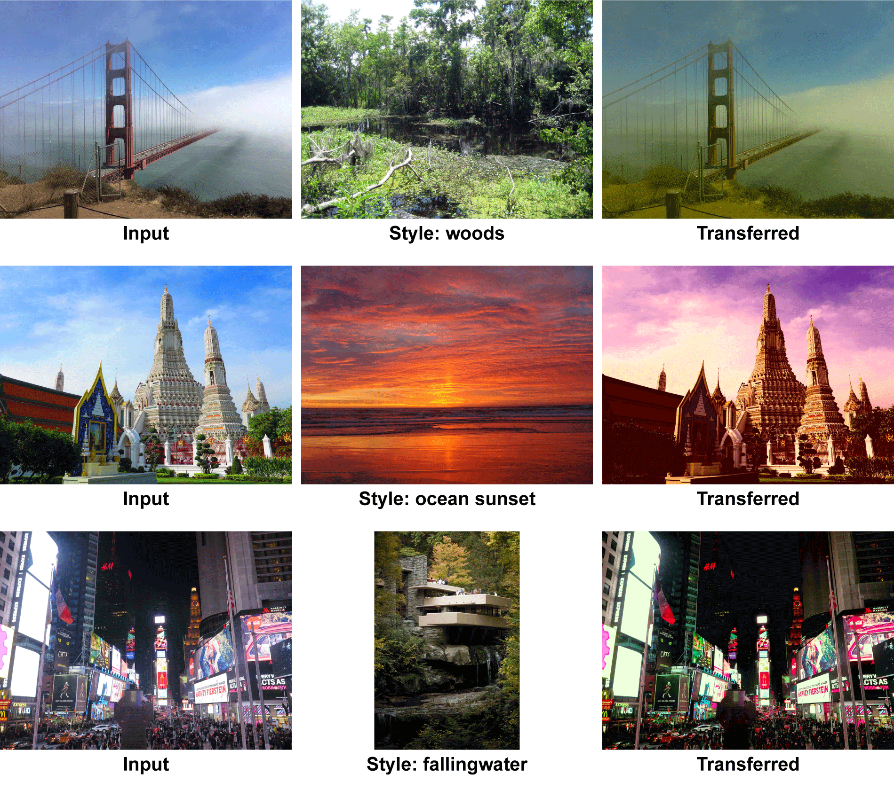

# color-transfer
Implementation of "Color transfer between images" [1]. My immplementation is based on [this blog[2]](https://www.pyimagesearch.com/2014/06/30/super-fast-color-transfer-images/). I'm also using same style images that used in above blog.

<p align="center">
  
</p>


## Environment
Ubuntu 18.04  
Python3.6(Anaconda3-5.2.0)


## Dependency

+ OpenCV3
+ numpy
+ sys
+ os


## Usage

```
python main.py argvs[1] argvs[2] 

--> 
argvs[1]  :  path to style image   
argvs[2]  :  path to target image

```

## References

[1] [Reinhard, Erik](http://erikreinhard.com/colour_transfer.html), et al. "Color transfer between images." IEEE Computer graphics and applications 21.5 (2001): 34-41. [[Paper](http://erikreinhard.com/papers/colourtransfer.pdf "Paper")]   
  
[2] Adrian's [blog](https://www.pyimagesearch.com/2014/06/30/super-fast-color-transfer-images/)
